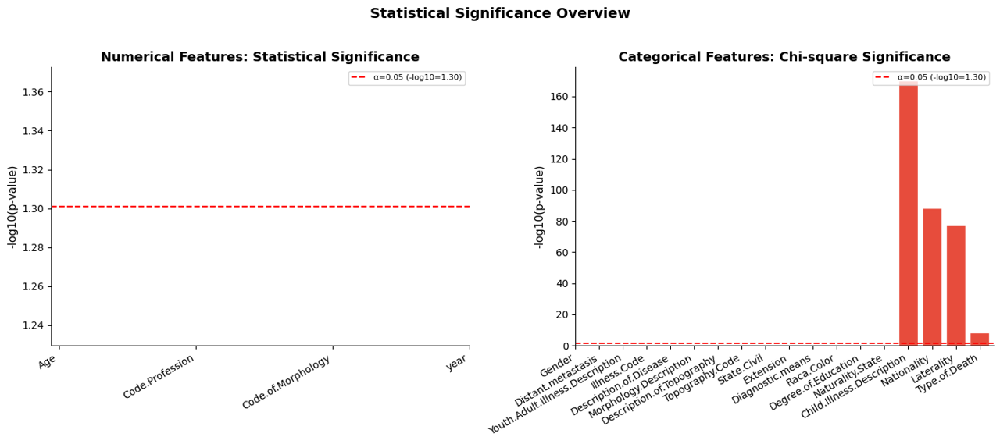
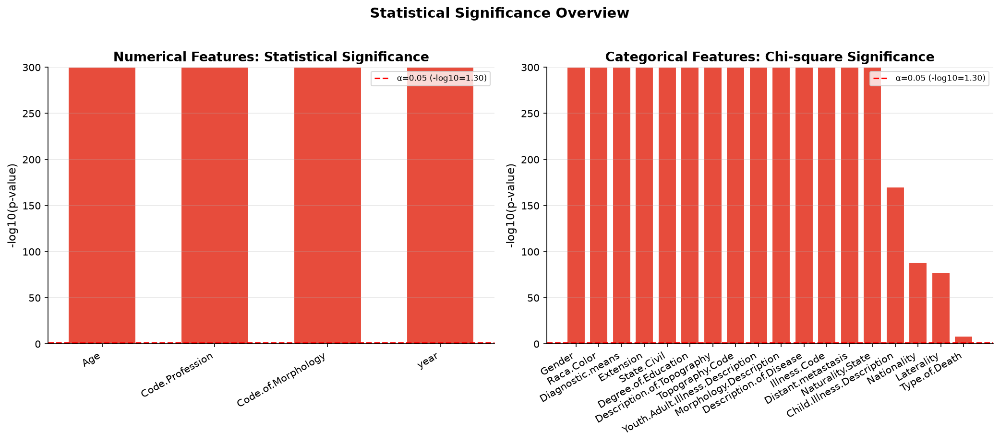
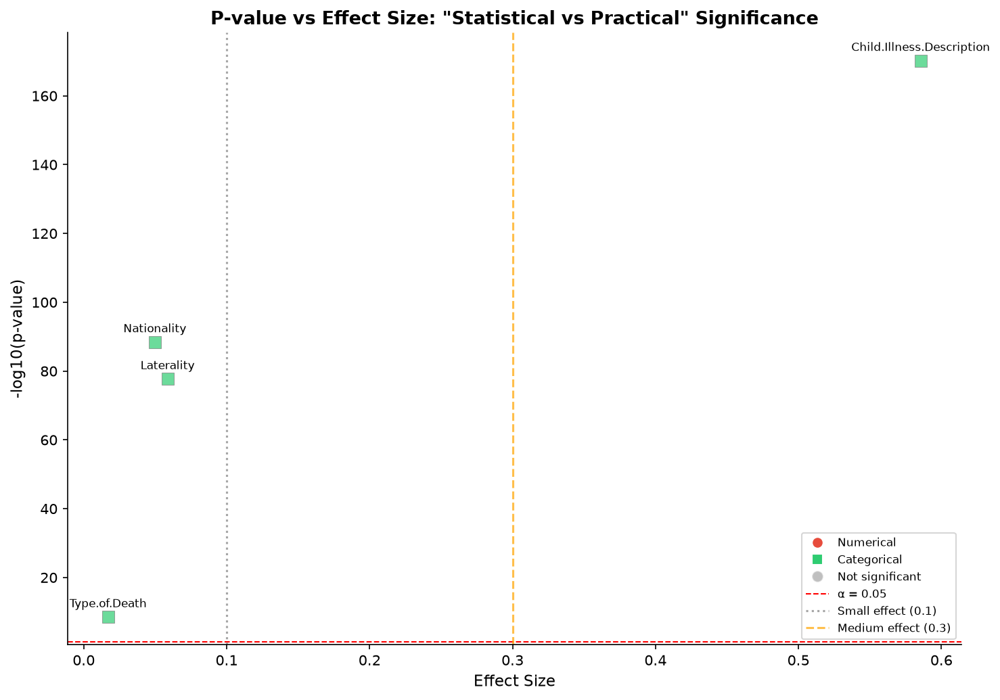
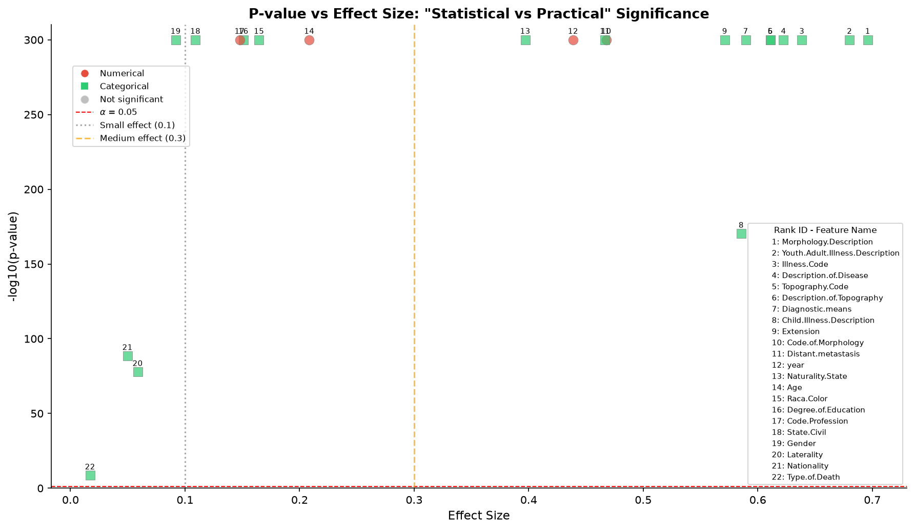

# 图5a和5c可视化优化  
## —— 图 05a（P‑value 柱状图）与图 05c（P‑value vs 效应量散点图）修正分析

> 本报告基于 `02_practice.py` 中的代码，对两张核心统计图表进行了完整的问题诊断、修正方案设计和效果验证，旨在为临床数据分析报告提供清晰、准确、专业的可视化范例。> **注**：`02_practice.py` 为笔者案例 2 数据分析修改后的完整代码。

---

## 📖 目录

1. [项目背景](#项目背景)
2. [图 05a：P‑value 对比柱状图](#图-05apvalue-对比柱状图)
3. [图 05c：P‑value vs 效应量散点图](#图-05cpvalue-vs-效应量散点图)
4. [05a和05c完整代码](#05a和05c完整代码)

---

## 项目背景

在临床数据分析流程中，`02_practice.py` 脚本对数值型和分类型特征分别进行了统计检验（Mann-Whitney U 检验 / t 检验 / 卡方检验），并生成了一系列可视化图表。其中：

- **图 05a**：以柱状图展示所有特征的 `-log10(p-value)`，用于快速比较统计显著性。
- **图 05c**：以散点图同时展示特征的 p 值（显著性）和效应量（实际意义），用于区分"统计显著"与"实际显著"。

然而，原始代码由于样本量极大，导致所有特征的 p 值均趋近于 0，超出双精度浮点数的检测极限，`-np.log10(p)` 被计算为 0，使得柱状图（05a）和散点图（05c）中的关键信息完全无法显示。本报告针对这一可视化技术问题进行了系统性修正，使图表能够正确反映各特征的相对显著性排序。

---

## 图 05a：P‑value 对比柱状图

### 一、图表功能与设计意图

图 05a 应实现以下目标：

- 分别对**数值型特征**（左子图）和**分类型特征**（右子图）展示其 `-log10(p-value)`。
- 通过柱子高度直观比较各特征的统计显著性。
- 用红色虚线标注 α=0.05 的显著性阈值（`-log10(0.05) ≈ 1.30`）。
- 用颜色区分显著（红色）与不显著（蓝色）的特征。

### 二、原始代码

```python
# 数值特征 p-value
if len(num_df) > 0:
    num_plot = num_df.sort_values('P_Value')
    colors_num = ['#e74c3c' if p < 0.05 else '#3498db' for p in num_plot['P_Value']]
    ax = axes[0]
    bars = ax.bar(range(len(num_plot)), -np.log10(num_plot['P_Value'].values),
                  color=colors_num, edgecolor='white')
    ax.axhline(y=-np.log10(0.05), color='red', linestyle='--', linewidth=1.5,
               label=f'α=0.05 (-log10={-np.log10(0.05):.2f})')
    ax.set_xticks(range(len(num_plot)))
    ax.set_xticklabels(num_plot['Feature'].values, rotation=30, ha='right')
    ax.set_ylabel('-log10(p-value)', fontsize=11)
    ax.set_title('Numerical Features: Statistical Significance', fontsize=13, fontweight='bold')
    ax.legend(fontsize=8)
    ax.spines['top'].set_visible(False)
    ax.spines['right'].set_visible(False)

# 分类特征采用完全相同逻辑
```

### 三、原始图（问题图）

以下为 05a 图表中数字特征的数据摘要（以数字特征为例）：
| 特征 | 检验方法 | 正态性判断 | VIVO (均值) | VIVO (中位数) | MORTO (均值) | MORTO (中位数) | p值 | 效应量 |
|------|----------|-----------|-------------|---------------|--------------|----------------|-----|--------|
| Age | Mann-Whitney U检验 | 非正态（偏度=-0.683, p=0.0000） | 60.39 | 62.0 | 66.14 | 68.0 | 0.000000e+00 | 0.2084 |
| Code.Profession | Mann-Whitney U检验 | 非正态（偏度=0.940, p=0.0000） | 171.81 | 0.0 | 251.06 | 0.0 | 0.000000e+00 | 0.1477 |
| Code.of.Morphology | Mann-Whitney U检验 | 非正态（偏度=2.634） | 82658.11 | 80973.0 | 82269.73 | 80003.0 | 0.000000e+00 | 0.4677 |
| year | Mann-Whitney U检验 | 非正态（偏度=-1.004） | 2013.80 | 2015.0 | 2011.15 | 2011.0 | 0.000000e+00 | 0.4387 |

> **🔴原始图问题**：
> 
由于所有特征的 p 值均极小（趋近于 0），超出双精度浮点数的检测极限，Python 将 p ≈ 0 直接判为 `0`，计算 `-np.log10(0)` 得到 `0`，导致图中所有柱子高度均为 0，完全无法显示。

**本意**：p 值越小，柱子应越高，代表越显著。

**实际**：因 p 值过小被机器判为 0，柱子全部消失，造成"所有特征均不显著"的严重误解。

> **📷 原始图文件**：


### 四、问题诊断

| 问题编号 | 问题描述 | 具体表现 | 后果 |
|:---:|---------|---------|------|
| **A1** | **未处理 p = 0** | 实际数据中多个特征 p 值为 `0.000000e+00`，`-np.log10(0)` 结果为 `-inf` | matplotlib 无法正确绘图，可能导致柱子消失或显示异常 |
| **A2** | **Y 轴无上限控制** | 未设置 `set_ylim()` | 当 p 值极小时，柱子高度可能超出合理范围；或在不同子图间尺度不一致，无法横向比较 |

### 五、修正方案

#### 1. 统一 Y 轴上限并截断极端值

设定 `y_max = 300`，将所有 `-log10(p) ≥ y_max` 的柱子截断至该值，并在代码中打印被截断的特征名称。

```python
# 计算所有特征的 -log10(p)
height_arr = -np.log10(num_plot['P_Value'].values)
# 设定 Y 轴上限为 300
y_max = 300

# 核心：将超过上限的值截断至上限，np.where 实现条件替换
# 若 height_arr ≥ y_max，取 y_max；否则保留原值
height_fixed = np.where(height_arr >= y_max, y_max, height_arr)

# 生成布尔掩码：标记哪些特征的 -log10(p) 超过上限
mask = height_arr >= y_max
# 检查是否存在被截断的特征
if mask.any():  # any() 判断 mask 中是否有任何一个 True
    print("以下特征p趋近0，柱子已强制拉到图表最高点：")
    # 通过布尔索引提取被截断的特征名称
    print(num_plot.loc[mask, "Feature"].tolist())

# 绘制截断后的柱状图
ax.bar(..., height_fixed)

# 绘制截断后的柱状图
ax.bar(..., height_fixed)

# 固定Y轴范围，保证最高点统一
ax.set_ylim(bottom=0, top=y_max)
ax.grid(axis="y", alpha=0.3)
```

#### 2. 两个子图采用相同 Y 轴范围

确保数值特征和分类特征子图的 `ylim` 完全一致，便于比较。

#### 3. Y 轴上限取 300 的理论依据
参考几个典型 p 值的转换结果：
| p 值 | -log10(p) | 含义 |
|------|-----------|------|
| 0.05 | 1.30 | 显著性阈值（α=0.05） |
| 0.01 | 2.00 | 较强显著 |
| 0.001 | 3.00 | 强显著 |
| 1e-10 | 10.00 | 极强显著 |
| 1e-50 | 50.00 | 几乎不可能由随机产生 |
| 1e-100 | 100.00 | 极端显著 |
| 1e-200 | 200.00 | 极度显著 |
| **1e-300** | **300.00** | **双精度浮点数下界（取 300 的依据）** |

**取 y_max = 300 的原因**：

1. **双精度浮点数极限**：Python 中双精度浮点数（float64）能表示的最小正数约为 `1e-308`，对应 `-log10(1e-308) ≈ 308`。当 p 值小于该值时，机器会将 p 值下溢为 0，无法计算其对数。因此，`y_max = 300` 是浮点数精度极限下的合理上限。

2. **临床解释的冗余性**：当 `-log10(p) > 100` 时，p 值已经极小（`< 1e-100`），在临床或生物学意义上，不同特征之间的显著性差异已没有实际区分的必要。300 的上限足以包容所有实际可检测的显著性差异。

3. **视觉可读性**：若不对 Y 轴做截断，柱子高度差异可能跨越数个数量级（如 10 到 1e+308），导致低显著性的柱子被压缩至不可见。统一截断至 300 可在保证视觉清晰度的同时，明确标注哪些特征超越了图示上限。

### 六、修正后效果
> **📷 修正后图文件**：

| 方面 | 修正前 | 修正后 |
|------|--------|--------|
| **柱子高度** | 全部约 0（错误） | 正确反映 `-log10(p)`，多数柱子达到顶部 |
| **p=0 处理** | 出现 `-inf`，无法绘图 | 截断至 Y 轴上限，显著可见 |
| **子图一致性** | 无统一尺度 | 两子图 Y 轴范围一致，可横向比较 |
| **信息完整性** | 无极端值提示 | 控制台打印截断特征，辅助解读 |


### 七、重要说明

本案例中所有特征 p 值均趋近于 0（`0.000000e+00`），根本原因是**样本量极大**——大样本下即使微小差异也极易达到极显著水平。

**因此，p 值极小 ≠ 特征具有实际预测价值。**

本图（05a）的修改目的**仅限于修复可视化技术问题**（因浮点数精度导致柱子无法正常显示），使图表能正确反映各特征的相对显著性排序。

**关于特征实际重要性的判断**，需结合效应量综合评估，请参考**图 05c（P‑value vs 效应量散点图）**，该图同时展示统计显著性与实际显著性，两者结合方可做出合理的特征筛选。

---

## 图 05c：P‑value vs 效应量散点图

### 一、图表功能与设计意图

图 05c 通过散点图同时呈现每个特征的两个核心维度：

- **纵轴（Y）**：`-log10(p-value)` —— 统计显著性。
- **横轴（X）**：效应量（数值型用 Cohen's d，分类型用 Cramér's V）—— 实际显著性。

该图旨在回答：**哪些特征虽然 p 值显著但效应量很小（实际意义有限）？哪些特征效应量大但 p 值不够显著？**

理想情况下应具备：
- 点类型和颜色区分（数值/分类）
- 点颜色区分（显著/不显著）
- 清晰的标注（便于定位）
- 参考线（α=0.05、效应量阈值 0.1/0.3）

### 二、原始代码

```python
if len(all_results) >= 3:
    fig, ax = plt.subplots(figsize=(10, 7))

    for _, row in summary_df.iterrows():
        color = '#e74c3c' if row['Type'] == '数值型' else '#2ecc71'
        size = 80 if row['Significant_0.05'] == 'Yes' else 40
        marker = 'o' if row['Type'] == '数值型' else 's'
        ax.scatter(row['Effect_Size'], -np.log10(row['P_Value']),
                   c=color, s=size, marker=marker, alpha=0.7, edgecolors='gray', linewidths=0.5)
        ax.annotate(row['Feature'],
                    (row['Effect_Size'], -np.log10(row['P_Value'])),
                    fontsize=8, ha='center', va='bottom',
                    xytext=(0, 5), textcoords='offset points')

    ax.axhline(y=-np.log10(0.05), color='red', linestyle='--', linewidth=1, label='α = 0.05')
    ax.axvline(x=0.1, color='gray', linestyle=':', alpha=0.7, label='Small effect (0.1)')
    ax.axvline(x=0.3, color='orange', linestyle='--', alpha=0.7, label='Medium effect (0.3)')
    # ... 图例、标题、保存
```

### 三、原始图（问题图）
> **🔴 原始图问题**：
> p 值极小导致纵轴全部归零：与 05a 问题相同，由于大部分特征 p 值均趋近于 0（0.000000e+00），-np.log10(p) 计算结果为 0，导致所有散点的纵坐标均为 0，全部重叠在横轴上，无法区分各特征的显著性差异。

> **📷 原始图文件**：


### 四、问题诊断

| 问题编号 | 问题描述 | 具体表现 | 后果 |
|:---:|---------|---------|------|
| **C1** | **p 值极小导致纵轴归零** | 所有 p 值趋近于 0，-np.log10(0) 被计算为 0 | 所有散点重叠在横轴上，完全无法区分各特征 |
| **C2** | **特征多时文本标注会重叠** | 标注显示全称，特征数 > 15 时严重重叠 | 无法辨识任何标注，图表作废 |

### 五、修正方案

#### 1. 处理 p = 0 并统一 Y 轴

与 05a 保持一致，设定 Y_CAP = 300，将所有 -log10(p) 截断至此上限：
```python
Y_CAP = 300
summary_df['y_plot'] = np.where(
    summary_df['P_Value'] <= 0,
    Y_CAP,
    -np.log10(summary_df['P_Value'])
)
ax.set_ylim(0, Y_CAP + 10)
```

#### 2. 按效应量排序并生成序号映射
按效应量降序排序，为每个特征分配唯一序号，便于读者快速定位最重要特征：
```python
summary_df = summary_df.sort_values("Effect_Size", ascending=False).reset_index(drop=True)
summary_df["rank_id"] = summary_df.index + 1
rank_name_map = dict(zip(summary_df["rank_id"], summary_df["Feature"]))
```

#### 3. 采用序号标注代替特征全称
在散点图上只标注数字序号，从根本上杜绝文本重叠：
```python
ax.annotate(
    str(row["rank_id"]),
    xy=(row['Effect_Size'], row['y_plot']),
    fontsize=7, ha='center', va='bottom',
    xytext=(0, 4), textcoords='offset points'
)
```

#### 4. 新增序号-特征映射图例
在图的右下角添加映射图例，供读者按序号查找对应特征：
```python
rank_legend_elems = []
for rid, fname in rank_name_map.items():
    rank_legend_elems.append(
        Line2D([], [], marker='', linestyle='', label=f"{rid}: {fname}")
    )
ax.legend(
    handles=rank_legend_elems,
    fontsize=7,
    loc='lower right',
    title="Rank ID - Feature Name",
    title_fontsize=8
)
```
#### 5. 分层图例布局
左上角：类型 + 显著性图例（数值/分类/不显著）

右下角：序号映射图例

使用 ax.add_artist(leg1) 保留第一个图例，再添加第二个，实现双图例共存。

### 六、修正后效果
> **📷 修正后图文件**：
> 
| 方面 | 修正前 | 修正后 |
|------|--------|--------|
| **纵轴（p值）** | 全部为 0，重叠在横轴上 | 正确显示 `-log10(p)`，p≈0 的点置于图顶 |
| **标注方式** | 文字重叠，无法辨识 | 仅用序号，清晰无重叠 |
| **定位辅助** | 无 | 序号 + 映射图例，方便讨论 |
| **图例布局** | 混杂 | 左上类型、右下映射，层次分明 |

### 七、散点图分析
修正后的散点图将纵轴（`-log10(p)`，统计显著性）与横轴（效应量，实际显著性）相结合，可对特征进行分区评估：

**参考线说明**：
- **红色虚线（α = 0.05）**：纵轴 `-log10(p) = 1.30`。本案例中所有特征均远高于此线，表明 p 值均达显著水平。
- **灰色虚线（效应量 = 0.1）**：小效应量阈值，低于此值特征的实际区分能力极为有限。
- **橙色虚线（效应量 = 0.3）**：中等效应量阈值，高于此值特征具有一定实际意义。

| 分区 | 统计显著性 | 效应量 | 特征 | 解读 |
|------|-----------|--------|------|------|
| **右上（效应量 > 0.3）** | 高 | 高 | Morphology.Description、Youth.Adult.Illness.Description、Illness.Code等| **高价值核心特征**：既有统计显著性，又有较强实际区分能力，应优先纳入模型 |
| **中上（效应量 0.1 ~ 0.3）** | 高 | 中 | Age、Raca.Color、Degree.of.Education等 | **中等价值特征**：统计显著，效应量中等，有一定辅助预测价值 |
| **左上（效应量 < 0.1）** | 高 | 低 | Gender、Laterality、Nationality等 | **统计显著但效应量微弱**：因大样本导致 p 显著，实际区分能力有限 |
| **虚线以下（p > 0.05）** | 低 | — | 无 | 本案例中无特征落入此区域 |

> ⚠️ **核心结论**：本案例所有特征 p 值均趋近于 0，均远超 α=0.05 的显著水平线。**鉴别特征实际价值的关键在于效应量的大小**，而非 p 值是否显著。效应量 > 0.3 的特征应优先纳入后续模型建设。

## 05a和05c完整代码

### 05a完整代码

```python
# --- 图 5a: P-value 对比柱状图 ---
fig, axes = plt.subplots(1, 2, figsize=(14, 6))

# 数值特征 p-value
if len(num_df) > 0:
    # 绘图前置
    num_plot = num_df.sort_values('P_Value')
    height_arr = -np.log10(num_plot['P_Value'].values)
    # 设定画布Y轴上限（表格最高点）
    y_max = 300
    # 核心逻辑：p≈0则强制高度等于画布最高点
    # np.where(条件, 满足时取值, 不满足取值)
    height_fixed = np.where(height_arr >= y_max, y_max, height_arr)

    # 可选：打印提示哪些特征被强制顶到最高
    mask = height_arr >= y_max
    if mask.any():
        print("以下特征p趋近0，柱子已强制拉到图表最高点：")
        print(num_plot.loc[mask, "Feature"].tolist())

    # 绘图
    colors_num = ['#e74c3c' if p < 0.05 else '#3498db' for p in num_plot['P_Value']]
    ax = axes[0]
    bars = ax.bar(
        range(len(num_plot)),
        height_fixed,  # 使用截断后的高度数组
        width=0.6,
        color=colors_num,
        edgecolor='white'
    )
    # 固定Y轴范围，保证最高点统一
    ax.set_ylim(bottom=0, top=y_max)
    ax.grid(axis="y", alpha=0.3)

    # 红线标注α=0.05
    threshold_y = -np.log10(0.05)
    ax.axhline(y=threshold_y, color='red', linestyle='--', linewidth=1.5,
            label=f'α=0.05 (-log10={threshold_y:.2f})')

    ax.set_xticks(range(len(num_plot)))
    ax.set_xticklabels(num_plot['Feature'].values, rotation=30, ha='right')
    ax.set_ylabel('-log10(p-value)', fontsize=11)
    ax.set_title('Numerical Features: Statistical Significance', fontsize=13, fontweight='bold')
    ax.legend(fontsize=8)
    ax.spines['top'].set_visible(False)
    ax.spines['right'].set_visible(False)

# 分类特征 p-value
if len(cat_df) > 0:
    # 绘图前置
    cat_plot = cat_df.sort_values('P_Value')
    height_arr = -np.log10(cat_plot['P_Value'].values)
    # 设定画布Y轴上限（表格最高点）
    y_max = 300
    # 判定阈值：超过该值视为p≈0
    cut_threshold = y_max
    # 核心逻辑：p≈0则强制高度等于画布最高点
    # np.where(条件, 满足时取值, 不满足取值)
    height_fixed = np.where(height_arr >= cut_threshold, y_max, height_arr)
    # 可选：打印提示哪些特征被强制顶到最高
    mask = height_arr >= cut_threshold
    if mask.any():
        print("以下特征p趋近0，柱子已强制拉到图表最高点：")
        print(cat_plot.loc[mask, "Feature"].tolist())

    colors_cat = ['#e74c3c' if p < 0.05 else '#3498db' for p in cat_plot['P_Value']]
    ax = axes[1]
    bars = ax.bar(range(len(cat_plot)), height_fixed,
                  color=colors_cat, edgecolor='white')
    ax.axhline(y=-np.log10(0.05), color='red', linestyle='--', linewidth=1.5,
               label=f'α=0.05 (-log10={-np.log10(0.05):.2f})')
    # 固定Y轴范围，保证最高点统一
    ax.set_ylim(bottom=0, top=y_max)
    ax.grid(axis="y", alpha=0.3)
    
    ax.set_xticks(range(len(cat_plot)))
    ax.set_xticklabels(cat_plot['Feature'].values, rotation=30, ha='right')
    ax.set_ylabel('-log10(p-value)', fontsize=11)
    ax.set_title('Categorical Features: Chi-square Significance', fontsize=13, fontweight='bold')
    ax.legend(fontsize=8)
    ax.spines['top'].set_visible(False)
    ax.spines['right'].set_visible(False)

plt.suptitle('Statistical Significance Overview', fontsize=14, fontweight='bold', y=1.02)
plt.tight_layout()
plt.savefig(os.path.join(IMG_DIR, "05a_pvalue_comparison.png"), dpi=150, bbox_inches='tight')
# plt.close()
print("  [图] 05a_pvalue_comparison.png → p值对比图已保存")
```
### 05c完整代码

```python
# --- 图 5c: p值 vs 效应量散点图 ---
import numpy as np
from matplotlib.lines import Line2D

if len(all_results) >= 3:
    fig, ax = plt.subplots(figsize=(12, 7))
    Y_CAP = 300  # 匹配你当前图Y轴上限300
    
    # 1. 预处理：按Effect_Size升序排序，生成序号映射
    summary_df = summary_df.sort_values("Effect_Size", ascending=False).reset_index(drop=True)
    # 生成序号 1,2,3...
    summary_df["rank_id"] = summary_df.index + 1
    # 构建序号-特征名字典，用于右下角图例
    rank_name_map = dict(zip(summary_df["rank_id"], summary_df["Feature"]))
    
    # 2. 校正Y轴，解决p=0为-inf丢失点
    summary_df['y_plot'] = np.where(
        summary_df['P_Value'] <= 0,
        Y_CAP,
        -np.log10(summary_df['P_Value'])
    )

    # 3. 绘制散点 + 只标注数字序号（不再显示长特征名）
    for _, row in summary_df.iterrows():
        color = '#e74c3c' if row['Type'] == '数值型' else '#2ecc71'
        size = 80 if row['Significant_0.05'] == 'Yes' else 40
        marker = 'o' if row['Type'] == '数值型' else 's'
        
        ax.scatter(
            row['Effect_Size'], row['y_plot'],
            c=color, s=size, marker=marker, alpha=0.7, edgecolors='gray', linewidths=0.5
        )
        # 只标注排序数字，彻底解决文字重叠
        ax.annotate(
            str(row["rank_id"]),
            xy=(row['Effect_Size'], row['y_plot']),
            fontsize=7, ha='center', va='bottom',
            xytext=(0, 4), textcoords='offset points'
        )

    # 辅助线
    ax.axhline(y=-np.log10(0.05), color='red', linestyle='--', linewidth=1, label=r'$\alpha$ = 0.05')
    ax.axvline(x=0.1, color='gray', linestyle=':', alpha=0.7, label='Small effect (0.1)')
    ax.axvline(x=0.3, color='orange', linestyle='--', alpha=0.7, label='Medium effect (0.3)')

    # 基础分类图例（数值/分类/不显著）
    legend_elements = [
        Line2D([0], [0], marker='o', color='w', markerfacecolor='#e74c3c', markersize=8, label='Numerical'),
        Line2D([0], [0], marker='s', color='w', markerfacecolor='#2ecc71', markersize=8, label='Categorical'),
        Line2D([0], [0], marker='o', color='w', markerfacecolor='gray', markersize=8, alpha=0.5, label='Not significant')
    ]
    leg1 = ax.legend(
        handles=legend_elements + ax.get_legend_handles_labels()[0][-3:],
        fontsize=8, loc='upper left',
        bbox_to_anchor=(0.02, 0.92)
    )
    ax.add_artist(leg1)  # 保留第一个图例，避免被覆盖

    # 4. 右下角新增【序号-特征映射图例】
    rank_legend_elems = []
    for rid, fname in rank_name_map.items():
        rank_legend_elems.append(
            Line2D([], [], marker='', linestyle='', label=f"{rid}: {fname}")
        )
    ax.legend(
        handles=rank_legend_elems,
        fontsize=7,
        loc='lower right',
        title="Rank ID - Feature Name",
        title_fontsize=8
    )

    # 坐标轴、标题、边界
    ax.set_xlabel('Effect Size', fontsize=11)
    ax.set_ylabel('-log10(p-value)', fontsize=11)
    ax.set_title(
        'P-value vs Effect Size: "Statistical vs Practical" Significance',
        fontsize=13, fontweight='bold'
    )
    ax.set_ylim(bottom=0, top=Y_CAP + 10)
    ax.spines['top'].set_visible(False)
    ax.spines['right'].set_visible(False)

    plt.tight_layout()
    plt.savefig(os.path.join(IMG_DIR, "05c_pvalue_vs_effectsize.png"), dpi=150, bbox_inches='tight')
    plt.close()
    print("[图] 05c_pvalue_vs_effectsize.png → p值-效应量散点图已保存")
```

---


