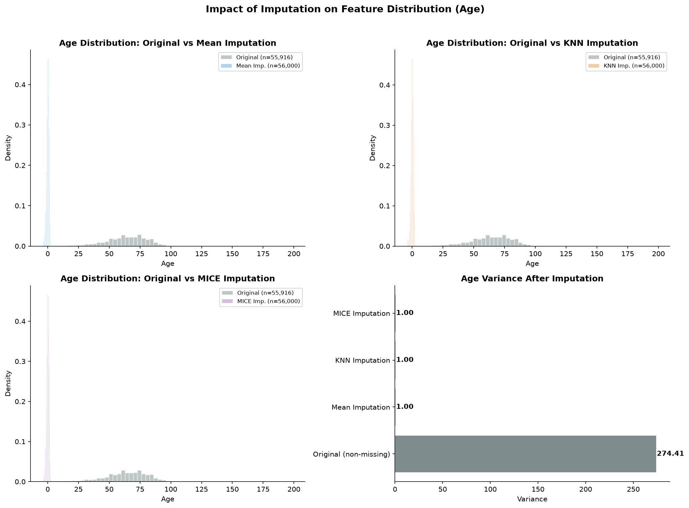
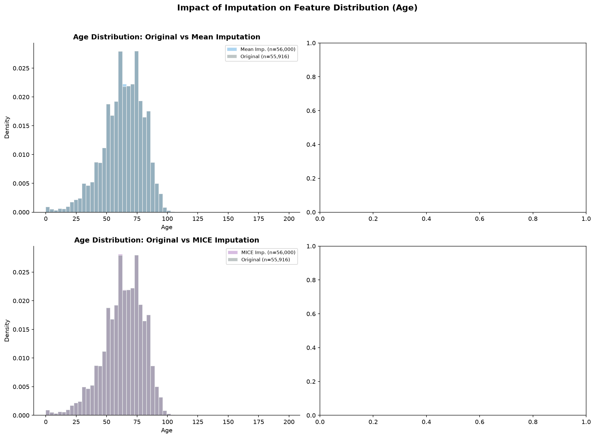
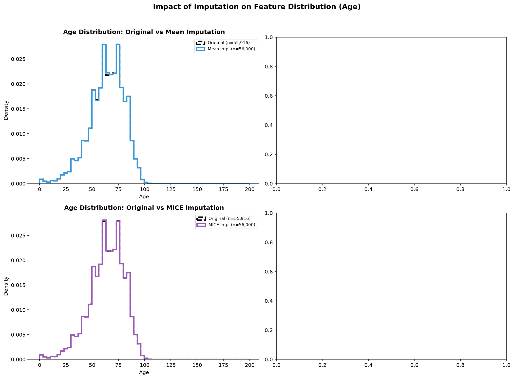
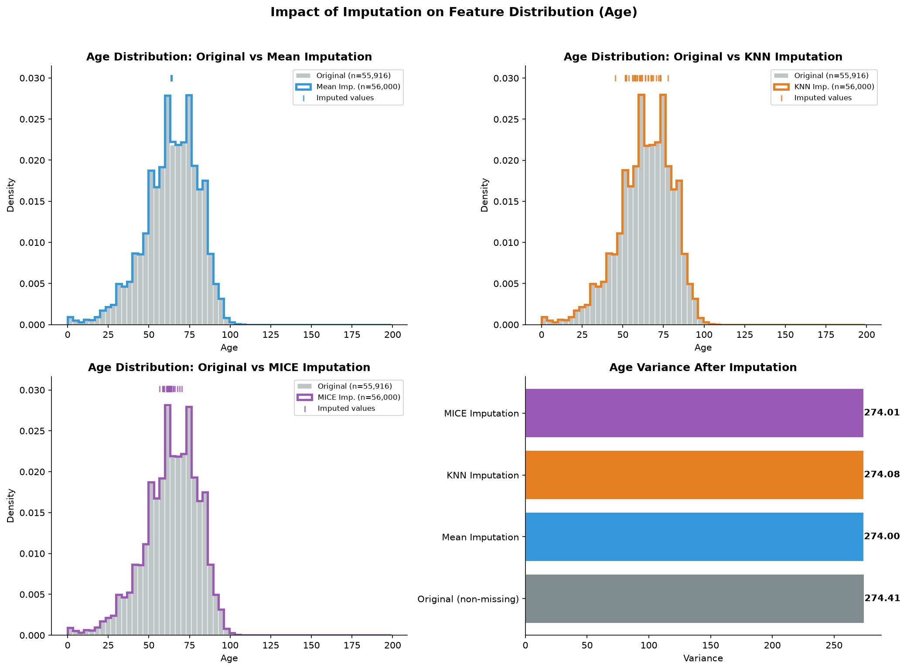

# 图 06e 可视化优化迭代报告

## —— 插补对特征分布影响的可视化演进（以 Age 为例）

> 本报告记录了 `03_practice.py` 中图 06e（插补前后分布对比图）的迭代优化过程，从原始版本逐步演进，通过持续发现问题和修正，最终实现了对插补效果的有效可视化。


## 一、图表背景与设计意图

图 06e 的目标是**直观展示不同插补方法（Mean、KNN、MICE）对 Age 特征分布的影响**，包括：

1. **分布对比**：将插补后数据集与原始数据集的 Age 分布叠加显示
2. **方差对比**：比较不同方法插补后的方差变化，评估插补对数据变异性的影响


## 二、版本 0：原始图（核心错误）

**问题截图**：
### 观察数据

我们可以输出插补值的数据来分析：（这里的插补值应该是最后一次插补，即MICE插补的结果）
```python
mask_missing = X_train['Age'].isna()  # 原始训练集缺失标记
filled_age = X_train_imp.loc[mask_missing, 'Age']
print("所有插补填充的年龄值: ", filled_age.unique())
print("填充值范围: ", filled_age.min(), "~", filled_age.max())
```
得到结果如下：
```python
所有插补填充的年龄值： [-0.1618    -0.28578257 -0.02215785 -0.13091578 -0.12714621  0.30824933
-0.01443679 -0.05304208 -0.10613484 -0.13863683  0.38266949 -0.14635789
0.00100532 -0.26678836 -0.00671574 -0.16952106 -0.06119997  0.07476061
-0.08366741  0.12732908 -0.11736856 -0.15407895 -0.31654038  0.06352689
-0.17724212 -0.07243369 -0.15811236  0.22424147 -0.43297687 -0.29407295]
填充值范围： -0.4329768667177616 ~ 0.38266948984797644
```

### 问题描述

原代码在绘制图 06e 时，直接从标准化后的 `X_train_imp` 中提取 Age 数据：

```python
age_data[method_name] = X_train_imp['Age'].copy()  # 已标准化
```

由于 Age 已经过 `StandardScaler` 标准化处理（均值为 0，方差为 1），导致：

- 插补值集中分布在 **0** 附近（即标准化后的均值位置），完全偏离实际 ❌ 
- 方差对比图中，各插补方法的方差均显示为 **1.00**，无法反映真实的变异性差异 ❌ 


## 三、版本 1：修正标准化问题
**图片展示**：
### 变化

-修正了插补数据提取方式，插补后的 Age 分布恢复至真实数值范围

-在初步探索中暂未纳入 KNN 插补，因其计算耗时较长，影响迭代效率


### 新发现的问题

虽然数据尺度正确，但由于 Age 的缺失率仅为 **0.15%**（约 84 个缺失值），插补后的 56,000 个样本中，仅 84 个值（0.15%）是通过插补生成的。大量原始值的叠加使得插补值的分布完全被淹没，三条密度曲线几乎完全重合，肉眼无法分辨差异。

> ⚠️ **新问题**：插补值被原始数据淹没，肉眼无法看到插补效果。


## 四、版本 2-3：中间过渡

### 版本 2

- 画出插补前后数据分布的轮廓线，试图让差异更明显

> **图片展示**：

### 版本 3

- 插补后数据用轮廓线，原始数据用灰色填充
- 只能观察到均值插补在均值64处有一小块空白（84个数据全部插补为同一个值所致），其余方法仍不明显
> **图片展示**：

### 遗留问题

> ⚠️ 图形本身仍然无法清晰展示插补值的位置和分布，需要依赖文字解释，违背了“一图胜千言”的可视化原则。

## 五、版本 4：掩码方案（最终版）

### 1、核心思路

针对“插补值被淹没”的问题，利用缺失掩码单独提取插补值，在图上**独立标注**，而不是让它们淹没在整体分布中。

### 2、核心代码逻辑(以均值插补为例)

```python
# --- 图 6e: 插补前后分布对比 (以 Age 为例) ---
fig, axes = plt.subplots(2, 2, figsize=(14, 10))

# 获取 Age 列在各个插补数据集中的分布（标准化前）
age_data = {}
for method_name in ['Mean Imputation', 'KNN Imputation', 'MICE Imputation']:
    age_data[method_name] = age_before_scale[method_name]  #修改

# 原始 Age (非缺失部分)
age_original = X_train.dropna(subset=['Age'])['Age']

# 缺失掩码（用于提取被插补的值）
missing_mask = X_train['Age'].isna()

# ---- 子图 1: Mean Imputation ----
ax = axes[0, 0]
# 原始分布（灰色填充）
ax.hist(age_original, bins=60, alpha=0.5, density=True,
        color='#7f8c8d', label=f'Original (n={len(age_original):,})', edgecolor='white')
# 均值插补分布（轮廓线）
ax.hist(age_data['Mean Imputation'], bins=60, density=True, histtype='step',
        color='#3498db', linestyle='-', linewidth=2.5,
        label=f'Mean Imp. (n={len(age_data["Mean Imputation"]):,})')
# 标记被插补的值
imputed_vals = age_data['Mean Imputation'][missing_mask]
# 获取当前 y 轴范围，将标记放在顶部 102% 位置
y_top = ax.get_ylim()[1] if ax.get_ylim()[1] > 0 else 1.0
ax.scatter(imputed_vals, [y_top * 1.02] * len(imputed_vals),
           marker='|', s=50, color='#3498db', alpha=0.8, label='Imputed values')  #新增
ax.set_title('Age Distribution: Original vs Mean Imputation', fontsize=12, fontweight='bold')
ax.set_xlabel('Age')
ax.set_ylabel('Density')
ax.legend(fontsize=8)
ax.spines['top'].set_visible(False)
ax.spines['right'].set_visible(False)
```

### 3、最终效果
**图片展示**：
> 

每个子图包含三条信息：
| 图例 | 颜色 | 含义 |
|------|------|------|
| **Original** | 灰色填充（半透明） | 原始数据的 Age 分布（n=55,916） |
| **Mean/KNN/MICE Imputation** | 蓝/橙/紫（实线） | 插补后完整数据集的分布（n=56,000） |
| **Imputed values** | 蓝/橙/紫（竖线） | 仅插补生成的 84 个值的独立分布 |

### 4、图片分析

#### （1）插补值分布差异

三个子图展示了不同插补方法生成的 Age 插补值在整体分布中的位置：

| 插补方法 | 插补值分布特征 | 图示表现 |
|---------|--------------|----------|
| **均值插补（Mean）** | 所有缺失值被替换为**同一个值**（Age 均值附近） | 插补区域集中在一个狭窄区间，几乎呈一条竖线 |
| **KNN 插补（KNN）** | 不同缺失样本根据其邻居特征获得**不同的插补值** | 插补区域分布较为分散，在 Age 密度高处（50-70 岁）分布更集中，尾部较少 |
| **MICE 插补（MICE）** | 通过迭代建模预测，插补值相对集中 | 插补区域较为集中，介于均值插补和 KNN 插补之间 |

**解读**：
- **均值插补**：所有缺失值被替换为训练集 Age 的均值，因此插补值集中在一点。这种方法简单粗暴，会严重低估 Age 的变异性，后续建模中该特征的区分能力可能被削弱。
- **KNN 插补**：插补值分布最广，体现了“不同样本补不同值”的特点。在 Age 密度高处（50-70 岁）插补值分布更密集，说明 KNN 倾向于将缺失样本的 Age 补到其近邻所在的常见年龄段，逻辑上较为合理。
- **MICE 插补**：插补值集中度介于两者之间。通过多重迭代建模，插补值表现出一定的变异性，但相比 KNN 更为聚集，说明模型对 Age 的预测较为稳定。

#### （2）方差对比分析

从右下角的方差对比条形图可以看出：

| 数据 | 方差 | 说明 |
|------|------|------|
| **原始数据（非缺失）** | **274.41** | 真实数据变异性基准 |
| Mean Imputation | ~274.00 | 与原始几乎一致 |
| KNN Imputation | ~274.08 | 与原始几乎一致 |
| MICE Imputation | ~274.01 | 与原始几乎一致 |

**解读**：
- 三种插补方法插补后的整体方差均与原始数据（274.41）非常接近，说明在整体分布层面，三种方法均较好地保持了 Age 的整体变异性
- 这并不意味着三种方法效果相同——**方差只反映整体离散程度，不反映具体插补值是否准确**。例如均值插补将所有缺失值补为同一个值，理应在方差上造成明显下降，但由于原始数据缺失率极低（0.15%），84 个插补值对整体方差的影响微乎其微，所以方差几乎不变
- **结论**：在缺失率极低（<1%）的情况下，任何合理插补方法都不会对整体方差产生明显影响。**方差对比图在此案例中信息量有限，真正反映插补差异的是插补值本身的分布（图中竖线区域）**

## 六、版本演进总结

| 版本 | 变化 | 解决的问题 | 遗留问题 |
|------|------|-----------|----------|
| **v0** | 原始图 | — | 使用标准化后数据，分布严重失真 |
| **v1-3** | 改用标准化前数据 | 数据恢复真实尺度 | 插补值被原始值淹没，不可见 |
| **v4** | 利用掩码单独标注插补值 | 插补值清晰可见 ✅ | 无 |

## 七、关键经验总结

### 1. 数据标准化与可视化的冲突

- 标准化是建模的必要步骤，但**不适合直接用于可视化**
- 可视化应使用**原始尺度数据**，确保读者能直观理解实际含义
- **解决方案**：在标准化前保存原始值副本

### 2. 低缺失率下的可视化策略

- 当缺失率很低（< 1%）时，插补值在整体分布中会被完全淹没
- 简单叠加密度曲线无法显示插补效果
- **解决方案**：利用**缺失掩码**单独提取插补值，在图上独立标注

### 3. 可视化迭代方法

版本 0 发现标准化问题 → 版本 1 修正后发现插补值被淹没 → 版本 2-3 尝试调整参数和文字说明 → 版本 4 利用掩码从根本上解决问题。

### 4. "一图胜千言"

- 版本 3 试图用文字弥补视觉缺陷，但效果有限
- 版本 4 通过视觉手段（独立颜色标注）解决问题，信息传达效率显著提升

## 八、最终结论

通过从版本 0 到版本 4 的迭代优化，图 06e 最终实现了：

1. ✅ 数据尺度正确（真实 Age 值）
2. ✅ 插补值在图上清晰可见（竖线独立标注）
3. ✅ 三种插补方法（Mean、KNN、MICE）完整对比
4. ✅ 方差变化直观展示
5. ✅ 无需额外文字说明，图形本身即可传达核心信息

**核心启示**：当数据本身差异较小时，视觉优化的关键在于**如何突出差异点**——本例中利用缺失掩码定位插补值，是解决"低缺失率下插补效果不可见"问题的有效策略。

## 九、图06e完整代码

```python
import pandas as pd
import numpy as np
import matplotlib.pyplot as plt
from matplotlib import gridspec
import os
import warnings
import time

from sklearn.model_selection import train_test_split
from sklearn.preprocessing import StandardScaler, LabelEncoder
from sklearn.impute import SimpleImputer, KNNImputer
from sklearn.experimental import enable_iterative_imputer
from sklearn.impute import IterativeImputer
from sklearn.linear_model import LogisticRegression
from sklearn.metrics import (roc_auc_score, recall_score, roc_curve,
                             brier_score_loss, precision_recall_curve,
                             average_precision_score)
from sklearn.calibration import calibration_curve
warnings.filterwarnings('ignore')

BASE_DIR = r"C:\Users\32122\Desktop"
DATA_PATH = os.path.join(BASE_DIR, "data", "cancer_data_eng.csv")
IMG_DIR = os.path.join(BASE_DIR, "img")
RESULTS_DIR = os.path.join(BASE_DIR, "results")

os.makedirs(IMG_DIR, exist_ok=True)
os.makedirs(RESULTS_DIR, exist_ok=True)

# 随机种子
RANDOM_STATE = 42
N_SAMPLES = 80000  # 采样样本数 (平衡计算开销与统计可靠性)

'''
案例教程 3 流程:
┌─────────────────────────────────────────────────────────────┐
│ 模块 1: 数据加载与缺失值分析 (识别问题)                        │
│ 模块 2: 四种插补方法实现 (Mean / KNN / MICE / Complete Case)  │
│ 模块 3: 模型训练与评估指标计算 (AUC / Recall / Brier / PR-AUC) │
│ 模块 4: 可视化与结果解读                                      │
└─────────────────────────────────────────────────────────────┘
'''

print("\n[0] 加载数据与特征选择...")
df = pd.read_csv(DATA_PATH, low_memory=False, encoding='latin-1')

df['target'] = df['Status.Vital'].map({'VIVO': 1, 'MORTO': 0})
df = df.dropna(subset=['target'])
print(f"    有标签样本: {len(df):,}")

#特征选择
features_config = {
    'Age': 'numerical',           # 0.15% 缺失 — 连续数值
    'year': 'numerical',          # 0.00% 缺失 — 连续数值
    'Gender': 'categorical',      # ~0% 缺失 — 二分类
    'Diagnostic.means': 'categorical',  # 0.36% 缺失 — 诊断方式(7类)
    'Raca.Color': 'categorical',  # 15.31% 缺失 — 人种(5类)
}

#从字典派生特征列表
feature_names = list(features_config.keys())
numerical_features = [k for k,v in features_config.items() if v == 'numerical']
categorical_features = [k for k,v in features_config.items() if v == 'categorical']
print(f"\n    所选特征: {feature_names}")
print(f"    数值型: {numerical_features}")
print(f"    分类型: {categorical_features}")

#采样
np.random.seed(RANDOM_STATE)
if len(df) > N_SAMPLES:
    sample_idx = np.random.choice(len(df),N_SAMPLES,replace=False)#无放回
    df_sample = df.iloc[sample_idx].copy()
else:
    de_sample = df.copy
print(f"    分析样本量: {len(df_sample):,}")
print(f"    VIVO: {(df_sample['target'] == 1).sum():,} ({(df_sample['target'] == 1).mean() * 100:.2f}%)")
print(f"    MORTO: {(df_sample['target'] == 0).sum():,} ({(df_sample['target'] == 0).mean() * 100:.2f}%)")

#检查缺失情况
missing_info = []
for col in feature_names:
    n_miss = df_sample[col].isnull().sum()
    pct_miss = n_miss /len(df_sample)*100
    missing_info.append({'Feature':col,'Missing':n_miss,'Pct':pct_miss} )
    print(f"      {col:<20} 缺失: {n_miss:>6,} ({pct_miss:.2f}%)")

#======================================================================
# 数据集划分与编码
#======================================================================
print("\n[1] 数据集划分与编码...")

#提取特征矩阵X和标签向量y
X = df_sample[feature_names].copy() #80000*5的一个dataframe
y = df_sample['target'].values  #.values 把 Series 转成 numpy 数组

#划分训练集和测试集
X_train,X_test,y_train,y_test = train_test_split(
    X,y,test_size=0.3,random_state = RANDOM_STATE,stratify=y  #stratify=y分层抽样，适合数据不平衡，几乎无副作用
)

print(f"    训练集：{len(X_train):,}(VIVO:{y_train.sum():,})")
print(f"    测试集：{len(X_test):,}(VIVO:{y_test.sum():,})")

#保存缺失掩码
train_missing_mask = X_train.isnull()
test_missing_mask = X_test.isnull()

#LabekEncoder编码(关键)
label_encoders = {}
for col in categorical_features:
    le = LabelEncoder() #创建编码器
    non_null_train = X_train[col].dropna() 
    le.fit(non_null_train.astype(str)) #转字符串后拟合

    most_common = non_null_train.value_counts().index[0]
    #non_null_train.value_counts()：统计每个类别的频数，返回一个按频数降序排列的 Series
    #.index[0]：取第一个（频数最高的）类别，即众数（mode）

    def transform_with_unknown(x):
        if pd.isna(x):
                return np.nan
        x_str = str(x)
        if x_str in le.classes_:
             return le.transform([x_str])[0]
        else:
             return le.transform([most_common])[0]
    
    X_train[col] = X_train[col].apply(transform_with_unknown)
    X_test[col] = X_test[col].apply(transform_with_unknown)
    label_encoders[col] = le

X_train = X_train.astype(float)
X_test = X_test.astype(float)
#sklearn 插补器要求浮点输入，且整数类型不支持 NaN

#======================================================================
# 执行插补策略比较...
#======================================================================

methods = {
    'Complete Case': {
        'desc': '完整案例分析 (删除含缺失的行)',
        'imputer': None,
        'color': '#7f8c8d'
    },
    'Mean Imputation': {
        'desc': '均值插补 (数值:均值 / 分类:众数)',
        'imputer': SimpleImputer(strategy='mean'),
        'color': '#3498db'
    },
    
    'KNN Imputation': {
        'desc': 'KNN 插补 (n_neighbors=5)',
       'imputer': KNNImputer(n_neighbors=5, weights='distance'),
        'color': '#e67e22'
    },
    
    'MICE Imputation': {
        'desc': 'MICE 多重插补 (IterativeImputer)',
        'imputer': IterativeImputer(max_iter=10, random_state=RANDOM_STATE),
        'color': '#9b59b6'
    }
    #在医学统计和流行病学领域，MICE 是处理缺失值的金标准之一
}
#用字典非常方便，只需要一个循环就能够统一处理所有方法

results = [] #收集每种方法的评估指标：AUC、Recall、Brier
age_before_scale = {}  #新增
models = {} #保存训练好的回归模型，后续画ROC时复用
imputed_datasets = {}

for method_name,config in methods.items():
    print(f"\n  ▶ {method_name}: {config['desc']}")
    start_time = time.time()

    if method_name == 'Complete Case':
        #删除任何含有缺失的行
        train_mask = X_train.isnull().any(axis=1)
        test_mask = X_test.isnull().any(axis=1) 

        X_train_imp = X_train[~train_mask].copy()
        y_train_imp = y_train[~train_mask]
        X_test_imp = X_test[~test_mask].copy()
        y_test_imp = y_test[~test_mask]

        n_dropped_train = train_mask.sum()
        n_dropped_test = test_mask.sum()
        print(f"      训练集删除: {n_dropped_train:,} 行 (保留 {len(X_train_imp):,})")
        print(f"      测试集删除: {n_dropped_test:,} 行 (保留 {len(X_test_imp):,})")
    else:
        #均值插补
        imp = config['imputer']   # SimpleImputer(strategy='mean')
        X_train_imp = pd.DataFrame(
            imp.fit_transform(X_train),
            columns=feature_names,
            index=X_train.index
        )
        #fit：扫描X_train的每一列，计算并保存该列的均值，这些均值存在imp.statistics属性里
        #transform:把X_train中的缺失值替换成对应列的均值，返回一个新的Numpy数组
        #fit_transform返回Numpy数组，丢失了列名和索引，pd.dataframe把他重新包装
        X_test_imp = pd.DataFrame(
            imp.transform(X_test),
            columns=feature_names,
            index=X_test.index
        )
        #训练集用 fit_transform：从训练数据中学习插补参数（均值），然后应用。
        #测试集只能用 transform：直接使用训练集学到的参数，不能重新计算。
        y_train_imp = y_train
        y_test_imp = y_test
        #标签不删，均值插补不删除任何样本
    
    age_before_scale[method_name] = X_train_imp['Age'].copy()  #新增

    imputed_datasets[method_name] = (X_train_imp, X_test_imp, y_train_imp, y_test_imp)

 
    
    
    #标准化
    scaler = StandardScaler()
    if method_name == 'Complete Case':
        num_cols_train = [c for c in numerical_features if c in X_train_imp.columns]
    else:
        num_cols_train = numerical_features

    if num_cols_train:
        X_train_imp[num_cols_train] = scaler.fit_transform(X_train_imp[num_cols_train]) 
        #只对数值列标准化，分类列保持不变
        #从训练集计算 μ 和 σ，存入 scaler.mean_ 和 scaler.scale_，然后变换训练集
        X_test_imp[num_cols_train] = scaler.transform(X_test_imp[num_cols_train]) 
        #直接用训练集的 μ 和 σ 变换测试集

    '''
    ┌─────────────────────────────────────────────────────────┐
    │  1. 创建 LogisticRegression 模型（带类别平衡）           │
    │  2. lr.fit(X_train_imp, y_train_imp) 训练模型            │
    │  3. lr.predict_proba() → 预测概率                        │
    │  4. lr.predict()      → 预测类别                         │
    │  5. 计算 4 个指标：AUC / Recall / Brier / PR-AUC         │
    │  6. 计算 calibration_curve（校准曲线数据）               │
    │  7. 记录耗时、系数、模型对象，存入 results 列表          │
    └─────────────────────────────────────────────────────────┘
    '''

    #训练逻辑回归
    lr = LogisticRegression(
        class_weight='balanced',  #让少数类获得更高的权重
        max_iter=2000,  #设置优化算法的最大迭代次数，逻辑回归通过梯度下降算法迭代最优参数
        random_state=RANDOM_STATE,
        solver='lbfgs'  #制定优化算法
    )
    #训练模型（竟然只用了一行代码嘛😱）
    lr.fit(X_train_imp,y_train_imp)
    #X_train_imp:插补后的训练集特征矩阵（已标准化）
    #y_train_imp:训练集标签（0=MORTO,1=VIVO）

    #预测
    y_pred_proba = lr.predict_proba(X_test_imp)[:,1]  #预测概率
    #predict_proba返回一个形状为 (n_samples, n_classes) 的二维数组，每一行是该样本属于各类别的概率。
    y_pred = lr.predict(X_test_imp)  #预测类别

    #评估：AUC(ROC曲线下面积)
    #模型能否区分存活和死亡
    auc = roc_auc_score(y_test_imp,y_pred_proba)  #y_test_imp真实标签，y_pred_proba预测概率

    #评估：Recall召回率(VIVO)
    #Recall = TP / (TP + FN)
    #模型能否找到真正的存活患者
    #含义：在所有真实的 VIVO 患者中，模型正确识别了多少比例。
    recall = recall_score(y_test_imp,y_pred,pos_label=1)

    #评估：Brier Score(校准度)，预测概率与真实标签的均方误差，越低越好
    #预测是否可靠
    brier = brier_score_loss(y_test_imp,y_pred_proba)

    #评估：Average Precision (PR-AUC)是Precision-Recall 曲线下的面积
    avg_precision = average_precision_score(y_test_imp,y_pred_proba)
    #当正负样本比例悬殊（如 1:100）时，优先看 PR-AUC，它比 ROC-AUC 更能反映模型对少数类的识别能力。

    #校准曲线数据
    prob_true,prob_pred =calibration_curve(
        y_test_imp,y_pred_proba,n_bins=20,strategy='uniform'
    ) 
    #calibration_curve() 的工作流程：
    #1、分箱：将预测概率 [0, 1] 等宽分成 10 个箱子（每箱宽 0.1）：[0-0.1], [0.1-0.2], ..., [0.9-1.0]。
    #2、统计每箱：
    #prob_pred（X 轴）：该箱内所有样本的预测概率均值。
    #prob_true（Y 轴）：该箱内所有样本的实际正例比例。
    #3、连线：将 10 个 (prob_pred, prob_true) 点连成曲线。

    #计算耗时
    elapsed =time.time()-start_time

    results.append({
        'Method': method_name,
        'AUC': auc,
        'Recall': recall,
        'Brier_Score': brier,
        'Avg_Precision': avg_precision,
        'Training_Size': len(y_train_imp),
        'Test_Size': len(y_test_imp),
        'Time': elapsed,
        'Calibration_True': prob_true,
        'Calibration_Pred': prob_pred,
        'Coefficients': lr.coef_[0] if hasattr(lr, 'coef_') else None,
        'Model': lr,
        'Color': config['color']
    })

    print(f"      AUC = {auc:.4f} | Recall = {recall:.4f} | Brier = {brier:.4f}")
    print(f"      耗时: {elapsed:.1f}s")

print("\n" + "=" * 70)
print("[3] 结果对比")
print("=" * 70)

results_df = pd.DataFrame(results)

print(f"\n  {'方法':<20} {'AUC':>8} {'Recall':>8} {'Brier':>8} {'PR-AUC':>8} {'样本量':>8} {'耗时':>8}")
print(f"  {'-'*20} {'-'*8} {'-'*8} {'-'*8} {'-'*8} {'-'*8} {'-'*8}")
for _, row in results_df.iterrows():
    print(f"  {row['Method']:<20} {row['AUC']:>8.4f} {row['Recall']:>8.4f} "
          f"{row['Brier_Score']:>8.4f} {row['Avg_Precision']:>8.4f} "
          f"{int(row['Training_Size']):>8,} {row['Time']:>7.1f}s")
   
'''
┌─────────────────────────────────────────────────────┐
│  好的模型 = 高 AUC（区分） + 高 Recall（捕捉）      │
│           + 低 Brier（校准） + 高 PR-AUC（不平衡）  │
└─────────────────────────────────────────────────────┘
'''

# --- 图 6e: 插补前后分布对比 (以 Age 为例) ---
fig, axes = plt.subplots(2, 2, figsize=(14, 10))

# 获取 Age 列在各个插补数据集中的分布（标准化前）
age_data = {}
for method_name in ['Mean Imputation', 'KNN Imputation', 'MICE Imputation']:
    age_data[method_name] = age_before_scale[method_name]  #修改

# 原始 Age (非缺失部分)
age_original = X_train.dropna(subset=['Age'])['Age']

# 缺失掩码（用于提取被插补的值）
missing_mask = X_train['Age'].isna()
mask_missing = X_train['Age'].isna()  # 原始训练集缺失标记
filled_age = X_train_imp.loc[mask_missing, 'Age']
print("所有插补填充的年龄值: ", filled_age.unique())
print("填充值范围: ", filled_age.min(), "~", filled_age.max())

# ---- 子图 1: Mean Imputation ----
ax = axes[0, 0]
# 原始分布（灰色填充）
ax.hist(age_original, bins=60, alpha=0.5, density=True,
        color='#7f8c8d', label=f'Original (n={len(age_original):,})', edgecolor='white')
# 均值插补分布（轮廓线）
ax.hist(age_data['Mean Imputation'], bins=60, density=True, histtype='step',
        color='#3498db', linestyle='-', linewidth=2.5,
        label=f'Mean Imp. (n={len(age_data["Mean Imputation"]):,})')
# 标记被插补的值
imputed_vals = age_data['Mean Imputation'][missing_mask]
# 获取当前 y 轴范围，将标记放在顶部 102% 位置
y_top = ax.get_ylim()[1] if ax.get_ylim()[1] > 0 else 1.0
ax.scatter(imputed_vals, [y_top * 1.02] * len(imputed_vals),
           marker='|', s=50, color='#3498db', alpha=0.8, label='Imputed values')  #新增
ax.set_title('Age Distribution: Original vs Mean Imputation', fontsize=12, fontweight='bold')
ax.set_xlabel('Age')
ax.set_ylabel('Density')
ax.legend(fontsize=8)
ax.spines['top'].set_visible(False)
ax.spines['right'].set_visible(False)

# ---- 子图 2: KNN Imputation ----
ax = axes[0, 1]
ax.hist(age_original, bins=60, alpha=0.5, density=True,
        color='#7f8c8d', label=f'Original (n={len(age_original):,})', edgecolor='white')
ax.hist(age_data['KNN Imputation'], bins=60, density=True, histtype='step',
        color='#e67e22', linestyle='-', linewidth=2.5,
        label=f'KNN Imp. (n={len(age_data["KNN Imputation"]):,})')
imputed_vals = age_data['KNN Imputation'][missing_mask]
y_top = ax.get_ylim()[1] if ax.get_ylim()[1] > 0 else 1.0
ax.scatter(imputed_vals, [y_top * 1.02] * len(imputed_vals),
           marker='|', s=50, color='#e67e22', alpha=0.8, label='Imputed values')
ax.set_title('Age Distribution: Original vs KNN Imputation', fontsize=12, fontweight='bold')
ax.set_xlabel('Age')
ax.set_ylabel('Density')
ax.legend(fontsize=8)
ax.spines['top'].set_visible(False)
ax.spines['right'].set_visible(False)

# ---- 子图 3: MICE Imputation ----
ax = axes[1, 0]
ax.hist(age_original, bins=60, alpha=0.5, density=True,
        color='#7f8c8d', label=f'Original (n={len(age_original):,})', edgecolor='white')
ax.hist(age_data['MICE Imputation'], bins=60, density=True, histtype='step',
        color='#9b59b6', linestyle='-', linewidth=2.5,
        label=f'MICE Imp. (n={len(age_data["MICE Imputation"]):,})')
imputed_vals = age_data['MICE Imputation'][missing_mask]
y_top = ax.get_ylim()[1] if ax.get_ylim()[1] > 0 else 1.0
ax.scatter(imputed_vals, [y_top * 1.02] * len(imputed_vals),
           marker='|', s=50, color='#9b59b6', alpha=0.8, label='Imputed values')
ax.set_title('Age Distribution: Original vs MICE Imputation', fontsize=12, fontweight='bold')
ax.set_xlabel('Age')
ax.set_ylabel('Density')
ax.legend(fontsize=8)
ax.spines['top'].set_visible(False)
ax.spines['right'].set_visible(False)

# ---- 子图 4: 方差对比条形图 ----
ax = axes[1, 1]
variances = []
var_labels = []
for method_name in ['Original (non-missing)', 'Mean Imputation', 'KNN Imputation', 'MICE Imputation']:
    if method_name == 'Original (non-missing)':
        variances.append(age_original.var())
    else:
        variances.append(age_data[method_name].var())
    var_labels.append(method_name)

colors_variance = ['#7f8c8d', '#3498db', '#e67e22', '#9b59b6']
bars = ax.barh(var_labels, variances, color=colors_variance, edgecolor='white')
for bar, val in zip(bars, variances):
    ax.text(val + 0.2, bar.get_y() + bar.get_height() / 2,
            f'{val:.2f}', va='center', fontsize=10, fontweight='bold')
ax.set_title('Age Variance After Imputation', fontsize=12, fontweight='bold')
ax.set_xlabel('Variance')
ax.spines['top'].set_visible(False)
ax.spines['right'].set_visible(False)

plt.suptitle('Impact of Imputation on Feature Distribution (Age)',
             fontsize=14, fontweight='bold', y=1.02)
plt.tight_layout()
plt.savefig(os.path.join(IMG_DIR, "06e-6.png"), dpi=150, bbox_inches='tight')
print("  [图] 06e.png → 插补对分布的影响图已保存")
```


